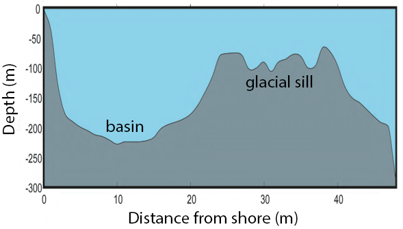

## Workshop outline

* Introduction to R on a cluster

* Microbiome data manipulation in RStudio using the [tidyverse](https://www.tidyverse.org/)

* Microbiome data visualization in RStudio using [phyloseq](https://www.bioconductor.org/packages/release/bioc/html/phyloseq.html)

* All data and materials are available at https://github.com/EDUCE-UBC/workshops/tree/master/microbiome_summer_school

## Why R/RStudio?

* Open source
* Command line and GUI options
* Reproducible research and version control (Rmarkdown, Rnotebook, etc.)
* Huge community of developers around the world
* Custom packages, many of which are applicable to microbiome data analysis
    + 28+ [CRAN](https://cran.r-project.org/web/packages/available_packages_by_name.html) package titles contain the word "DNA"
    + Dozens more on [Bioconductor](https://www.bioconductor.org/)

## Data description
* Part of an on-going oceanographic time series program in Saanich Inlet

* Geochemical measurements at various depths taken approximately monthly from 2006 to 2014

* 16S Illumina amplicon sequencing of 7 depths in August 2012

## {.centered}

**Figure 1.** Map of Saanich Inlet indicating conventional sample collection stations (S1-S9). Data used in this workshop is sourced from S3.

## {.centered}

 
 
**Figure 2.** Structure of Saanich Inlet. The glacial sill restricts water circulation into and out of the lower depth of the inlet basin.

## {.centered}

 
 
**Figure 3.** Contour plot of water column oxygen concentrations over multiple years in the time series. Note the recurring pattern of oxygen decline below 100 m depth intervals followed by seasonal renewal events in late Summer into early Fall carrying more oxygenated waters into the Inlet. 

## Data in this workshop

* 16S Illumina amplicon sequencing of 7 depths in Saanich Inlet (S3) from August 2012

* Corresponding geochemical data from 16 depths
    + Oxygen: O~2~ 
    + Nitrogen: NO~3~, NH~4~, NO~2~, N~2~O
    + Phosphorous: PO~4~
    + Sulfur: H~2~S
    + Carbon: CH~4~
    + Other: temperature, salinity

## Microbial questions
 
 
How do microbial communities change with depth or nutrient availability?

Is there a pattern in microbial communities in response to seasonal changes?

How can this inform our predictions for how ocean microbial communities will change with climate change (*i.e.* reduced oxygen and nitrogen, higher temperatures)?

## Phylogenetic answers?

* Sequences clustered into 97% operational taxonomic units (OTUs) as a proxy for microbial species
* Does not fully capture relatedness of "species"

 
 

* Phylogenetic approaches compare "species" at the sequence level
* Such analyses require a phylogenetic tree
    + This calculation is our current mission on cedar!

# R on the cluster

## More workshops

  
 
 
 

- **Next week**: Exploring the phylogenetic composition of microbiomes
- **July**: Reproducible research in R and Git

For more info and future workshops, see http://ecoscope.ubc.ca/events/

To contact Kim, email kadm@mail.ubc.ca

